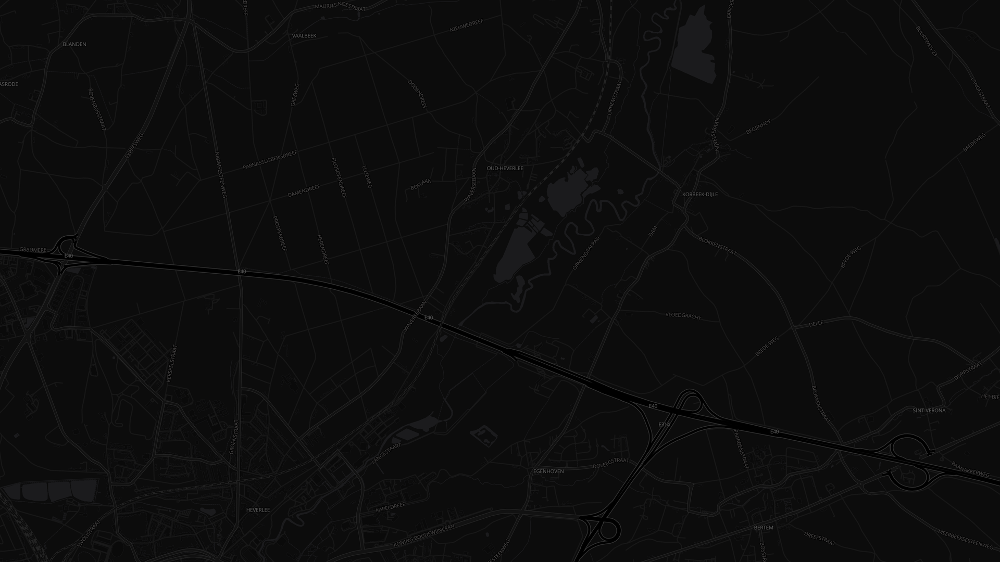

# BRIEF — Round v2 content edits

**Tier:** Execute (Sonnet). **Stop-on-ambiguity applies.** Every instruction below
quotes the exact current string to find. If a quoted string is not found exactly
once in `website/index.html`, stop and report the instruction number and what you
did find. Do not improvise wording; every replacement sentence is supplied.

Line numbers refer to `rounds/v1/index_v1.html` and are hints only; anchor on the
quoted strings.

**Prerequisite:** round v1 (`../v1/BRIEF-move.md`) is done, so the live page is
`website/index.html`.

**Read first:** `website/FEEDBACK.md` (standing rules). Two of them are acceptance
tests for this round: zero em-dashes anywhere in the file, and zero occurrences of
"time posted" and "failure".

---

## Part A: Deletions

### A1. Hero pitch paragraph (line 539)
Delete this whole element:
```
<p class="pitch">Press start. Ride. Save. Next time, you've got something to race — the last ten versions of you. Nothing to load in beforehand — ride a road once, and that ride becomes the route. Built from your own rides, not anyone else's.</p>
```
No replacement. The hero becomes mark + kicker + H1 + Start button + scroll hint.
That is intentional (Nathan called this paragraph clutter; a replacement pitch would
be more clutter). To keep the spacing the pitch used to provide, change the CSS rule
```
  .hero h1{
    font-size: clamp(1.9rem, 5vw, 3rem);
    max-width: 16ch;
    margin: 0 0 .4em 0;
  }
```
so the last line reads `margin: 0 0 28px 0;`. Then remove the now-dead rule block
`.hero .pitch{ ... }` (lines 172-177) entirely.

### A2. Hero tagline (line 541)
Delete this whole element:
```
<p class="hero-sig">Quali <span aria-hidden="true">+</span> fire — <b>the qualifying lap, and the moment a sector lights up.</b></p>
```
No replacement. Remove the dead CSS rules `.hero-sig{ ... }` and `.hero-sig b{ ... }`
(lines 198-205).

### A3. "While you ride — race mode" section (lines 591-617)
Delete the entire `<section id="live">` element, from the comment line
`<!-- ================= LIVE / RACE MODE ================= -->` through its closing
`</section>` (the one immediately before `<!-- ================= COLOUR ================= -->`).

Ruling and reason (for the record): the section shows a mocked HUD that is not
verified against the real ride screen, its copy is adjectives rather than mechanism,
and the sections around it already carry the full loop (ride, colour, tower). The v1
snapshot keeps it recoverable.

Also remove its now-dead CSS, the whole block from the comment
`/* ---------- LIVE / RACE ---------- */` (line 267) up to but not including
`/* ---------- COLOUR ---------- */` (line 352). That covers `#live`, `.race-surface`,
`.clock-block`, `.clock`, `.tier-flash`, `@keyframes flash-purple`, `.sector-strip`,
`.slot*`, `@keyframes pulse-in`, `.race-caption`.

In the `@media (max-width: 760px)` block remove these two lines:
```
    .race-surface{ grid-template-columns:1fr; text-align:center; }
    .sector-strip{ justify-content:center; }
```
In the `@media (prefers-reduced-motion: reduce)` block remove:
```
    .slot.filled{ opacity:1; transform:none; }
```
In the `<script>`, remove the whole block that starts with the comment
`// Re-trigger the sector-strip fill loop only while it's on screen` and ends with
`io.observe(strip);\n  }` (lines 795-806). Part C4 below adds its replacement.

Because `#live` provided the visual break between `#mechanic` and `#colour` (both
use `--pad-bg`), change
```
  #colour{ background:var(--pad-bg); }
```
to
```
  #colour{ background:var(--pad-bg); border-top:1px solid var(--pad-border); }
```

### A4. "A slow lap is time posted." (line 720)
This phrase IS in the file; a plain-text search misses it because a `<span>` splits
it. In `<section id="philosophy">` delete this whole line:
```
    <p>A slow lap is <span>time posted.</span></p>
```
Two lines remain in that section. Do not touch them.

### A5. "No delta plot" intro (line 655)
Handled as a replacement in Part D1, not a bare deletion.

---

## Part B: Em-dash sweep (every remaining occurrence, with the rewrite)

After Part A, these are all the em-dashes left. Replace each exactly as shown.
When done, `grep -c "—" website/index.html` must print 0. Also confirm 0 for
`&mdash;`, `&#8212;` and the en-dash `–`.

**B1, line 6, `<title>`**
`<title>Qualifire — Same road. New meaning.</title>`
becomes
`<title>Qualifire | Same road. New meaning.</title>`

**B2, line 7, meta description**
`...Press start, ride, save — a bit better every day.">`
becomes
`...Press start, ride, save. A bit better every day.">`

**B3, line 10, CSS comment**
`/* Paddock — default page mood */` becomes `/* Paddock: default page mood */`

**B4, line 15, CSS comment**
`/* Race — live-ride mood */` becomes `/* Race: live-ride mood */`
(The `--race-*` variables stay; harmless, and the day theme block redefines them.)

**B5, line 32, CSS comment**
`/* Day theme — same structure, lighter surfaces. Toggled via [data-theme="light"] on <html>. */`
becomes
`/* Day theme: same structure, lighter surfaces. Toggled via [data-theme="light"] on <html>. */`

**B6, line 515, aria-label**
`aria-label="Qualifire — back to top"` becomes `aria-label="Qualifire, back to top"`

**B7, line 550, mechanic intro** (also tightened)
`Press START at the door. From there, the app quietly splits your ride into sectors and times each one against your own recent history — no setup, nothing to configure mid-ride.`
becomes
`Press START at the door. From there, the app splits your ride into sectors and times each one against your own recent history. No setup, nothing to configure mid-ride.`

**B8, B9, B10, lines 556, 561, 566, the three step paragraphs**
Replaced wholesale in Part C2 (their rewrites are em-dash-free).

**B11, line 630, purple swatch**, **B12, line 635, green**, **B13, line 640, yellow**
Replaced wholesale in Part E3.

**B14, line 645, noise-floor callout**
`Colour only shows once there's someone to compare against. Your first ride on a route sets the mark — plain ink, nothing to race yet. The ride after that can go purple or yellow. From the third ride on, green joins the mix too.`
becomes
`Colour only shows once there is something to compare against. Your first ride on a route sets the mark and stays plain. The second ride can go purple or yellow. From the third ride on, green joins in.`

**B15, line 655, tower intro**
Replaced wholesale in Part D1.

**B16 to B20, the five tower placeholders (lines 665, 676, 679, 682, 685)**
These are structural, not prose: the label column of rows P1, P3, P4, P5, P6 holds
a bare `<div>—</div>`. Replace each with an empty `<div></div>`. The grid column keeps
its width, the row reads "P1 ... 14:19.4", and nothing invents a date. Rows P2
("Today"), the "3 more laps" row and P10 ("Slowest of the window") are untouched.
Exactly five replacements.

**B21, line 735, footer**
`It exists to make an ordinary ride worth riding again — nothing more.`
becomes
`It exists to make an ordinary ride worth riding again. Nothing more.`

**B22, line 736, footer fine print**
`Not for sale — any copy moves by hand, one phone at a time, to people already known.`
becomes
`Not for sale. Any copy moves by hand, one phone at a time, to people already known.`

---

## Part C: "How it works" section

### C1. H2 (line 549)
The hero H1 and this H2 are both "Same road. New meaning." With the pitch gone the
repeat is glaring. Change
`<h2>Same road. New meaning.</h2>` (the one inside `#mechanic`, NOT the hero `<h1>`)
to
`<h2>One ride sets the route. Every ride after it is timed.</h2>`
(Nathan did not ask for this; it is a Fable call and is listed under things to check.)

### C2. The three step paragraphs: smaller, more concise, formal
Replace the `<p>` inside each `.step`. Headings (`<h4>`) stay as they are.

Step 1, current:
`Bike, run, walk — you name the sport, the app doesn't care. On a blank install nothing is loaded in first: ride a road once, and at STOP you name where you started and ended. That ride becomes the route — its line and its sectors — ready to race from the next time you ride it.`
new:
`Bike, run or walk. Ride a road once and, at STOP, name where you started and ended. That ride becomes the route: its line and its sectors, ready to race next time.`

Step 2, current:
`Lines drawn perpendicular across your path, placed at the quarter points of your route and nudged away from anywhere your reference ride stood still — a red light, a crossing. You never see them. You only feel the moment one falls behind you.`
new:
`Lines drawn across your path at the quarter points of the route, moved clear of anywhere the reference ride stood still, such as a red light or a crossing. You never see them. You only feel the moment one falls behind you.`

Step 3, current:
`Not a personal record from some mythical perfect ride — the rolling window of your last ten laps on that exact stretch. Recent you, not peak you. Only your very first ride on a route has no window yet, so it stays plain ink — every ride after that gets judged, the window growing toward ten as you keep riding it.`
new:
`Not a record from one perfect ride: the rolling window of your last ten laps on that stretch. Recent you, not peak you. Only your first ride on a route has no window and stays plain. Every ride after it is judged, the window growing toward ten.`

Size: change `.step p{ margin:0; font-size:.92rem; }` to
`.step p{ margin:0; font-size:.85rem; line-height:1.45; }`.

### C3. Replace the linear schematic with the real render
Delete the whole `<div class="schematic"> ... </div>` block (lines 570-587: the flat
SVG with GATE 1/2/3 labels and `#rideranim`). Delete its CSS: the block from
`.schematic{` through the `@keyframes ride-path{ ... }` (lines 249-265), which also
removes `.gate-line`, `.route-line`, `.gate-label`, `.rider-dot`, `#rideranim`.

Insert, at the exact spot the schematic was (after the closing `</div>` of
`.steps`, before the `.wrap` closes), this block. The geometry is copied from
`marketing/silent-studio/gates-saving/index.html` (same `ROUTE`, same gate fractions
0.24 / 0.63 / 0.84, same 44 px perpendicular ticks, same colours and stroke widths),
with the gate coordinates precomputed so no script is needed for placement.

```html
    <div class="map-render" role="img" aria-label="A real route on a map, split into four sectors by three gates, with a rider moving along it">
      <div class="cam">
        
        <svg id="mapsvg" viewBox="0 0 1920 1080" xmlns="http://www.w3.org/2000/svg" aria-hidden="true">
          <path id="route-casing" fill="none" stroke="#14120C" stroke-width="10" stroke-linejoin="round" stroke-linecap="round"
            d="M577,948.7 L578.3,946.1 L587.4,940.8 L590.9,942.8 L591,947.5 L594.6,952.3 L600.9,957.1 L612,951.2 L628.8,946.5 L640.6,940.1 L647,934.5 L650.7,933.1 L680,906.9 L682.9,905.7 L684.4,908.7 L687,909.9 L718.3,885.5 L755.1,859.2 L784.7,851.6 L830.7,830.3 L836.7,833.6 L848.2,835.8 L854.2,835.6 L858.6,833.9 L935.4,752.8 L975.7,720.7 L988.2,706 L988.5,693.2 L984.8,688.8 L977.8,684.5 L958.3,677.3 L954.2,679.7 L949.1,679.2 L915.3,666.6 L914.4,663 L916.5,658.5 L922.5,650.9 L924.4,645.7 L922.9,642.6 L923.9,641.4 L926.1,640.4 L929.9,641 L936.2,645 L949.8,650 L954.6,652.8 L977.5,661 L986.2,656.2 L1046.2,607.4 L1063.2,592.6 L1088.3,539.3 L1099,520.7 L1109.9,505.7 L1124.1,488.9 L1129.9,478.9 L1149.6,455.4 L1161,436.3 L1163,435 L1192.4,430.8 L1220.7,402.9 L1243.8,377.3 L1248.4,368.1 L1250.7,359.8 L1272,333.6 L1273.6,319.2 L1279.4,318.7 L1313.6,288.5 L1319.5,286.8 L1324.1,282.9 L1342.8,293.3 L1345,293.1"/>
          <path id="route-core" fill="none" stroke="#F5C542" stroke-width="6" stroke-linejoin="round" stroke-linecap="round"
            d="M577,948.7 L578.3,946.1 L587.4,940.8 L590.9,942.8 L591,947.5 L594.6,952.3 L600.9,957.1 L612,951.2 L628.8,946.5 L640.6,940.1 L647,934.5 L650.7,933.1 L680,906.9 L682.9,905.7 L684.4,908.7 L687,909.9 L718.3,885.5 L755.1,859.2 L784.7,851.6 L830.7,830.3 L836.7,833.6 L848.2,835.8 L854.2,835.6 L858.6,833.9 L935.4,752.8 L975.7,720.7 L988.2,706 L988.5,693.2 L984.8,688.8 L977.8,684.5 L958.3,677.3 L954.2,679.7 L949.1,679.2 L915.3,666.6 L914.4,663 L916.5,658.5 L922.5,650.9 L924.4,645.7 L922.9,642.6 L923.9,641.4 L926.1,640.4 L929.9,641 L936.2,645 L949.8,650 L954.6,652.8 L977.5,661 L986.2,656.2 L1046.2,607.4 L1063.2,592.6 L1088.3,539.3 L1099,520.7 L1109.9,505.7 L1124.1,488.9 L1129.9,478.9 L1149.6,455.4 L1161,436.3 L1163,435 L1192.4,430.8 L1220.7,402.9 L1243.8,377.3 L1248.4,368.1 L1250.7,359.8 L1272,333.6 L1273.6,319.2 L1279.4,318.7 L1313.6,288.5 L1319.5,286.8 L1324.1,282.9 L1342.8,293.3 L1345,293.1"/>
          <g class="gate"><line x1="818.9" y1="811.7" x2="832.2" y2="853.6" stroke="#14120C" stroke-width="8" stroke-linecap="round"/><line x1="818.9" y1="811.7" x2="832.2" y2="853.6" stroke="#F4F2EC" stroke-width="4" stroke-linecap="round"/></g>
          <g class="gate"><line x1="1035.1" y1="587.9" x2="1063.7" y2="621.3" stroke="#14120C" stroke-width="8" stroke-linecap="round"/><line x1="1035.1" y1="587.9" x2="1063.7" y2="621.3" stroke="#F4F2EC" stroke-width="4" stroke-linecap="round"/></g>
          <g class="gate"><line x1="1196.8" y1="395.6" x2="1227.6" y2="426.9" stroke="#14120C" stroke-width="8" stroke-linecap="round"/><line x1="1196.8" y1="395.6" x2="1227.6" y2="426.9" stroke="#F4F2EC" stroke-width="4" stroke-linecap="round"/></g>
          <circle cx="577" cy="948.7" r="13" fill="#14120C" stroke="#F4F2EC" stroke-width="4"/>
          <circle cx="1345" cy="293.1" r="13" fill="#14120C" stroke="#F4F2EC" stroke-width="4"/>
          <circle id="rider" cx="0" cy="0" r="11" fill="#2F7DE1" stroke="#FFFFFF" stroke-width="3">
            <animateMotion dur="12s" repeatCount="indefinite" calcMode="paced"><mpath href="#route-core"/></animateMotion>
          </circle>
        </svg>
      </div>
      <p class="map-attrib">© OpenStreetMap contributors · OpenFreeMap</p>
    </div>
```
(The `d` attribute is identical on both paths; that is intentional, casing under core,
exactly as the composition does it. Both `d` strings must be copied verbatim; 70 points.)

Add this CSS where the `.schematic` block used to be:
```css
  .map-render{
    margin-top:56px;
    position:relative;
    aspect-ratio:16 / 9;
    overflow:hidden;
    border-radius:12px;
    border:1px solid var(--pad-border);
    background:#0A0A0A;
  }
  .map-render .cam{
    position:absolute; inset:0;
    transform-origin:50% 50%;
    transform: translateY(-10.4%) scale(1.4);
  }
  .map-render img{ position:absolute; inset:0; width:100%; height:100%; max-width:none; }
  .map-render svg{ position:absolute; inset:0; width:100%; height:100%; }
  .map-attrib{
    position:absolute; right:12px; bottom:8px; margin:0;
    font-size:.68rem; letter-spacing:.02em; color:#9a978f; opacity:.85;
  }
```
Why those transform numbers: the route's bounding box in the 1920x1080 frame is
x 577..1345, y 283..957, centre (961, 620). Scaling 1.4x about the frame centre and
shifting up by 1.4 x (620 - 540) = 112 px = 10.4% of 1080 centres the route with a
49 px margin top and bottom inside the visible area. Same trick as `#cam` in the
composition, frozen.

Attribution is required by the map licence (see `marketing/silent-studio/_map/README.md`)
and stays.

### C4. Asset: `website/assets/map.png`
Source: `marketing/silent-studio/gates-saving/map.png` (3840x2160, 2,379,000 bytes;
identical copies also sit in `start-ride/` and `ranking/`). It is the captured
OpenFreeMap dark basemap at centre 4.663233 / 50.84662, zoom 13.4, the exact framing
the `ROUTE` above was projected against. Do not re-capture, do not crop.

1. `device_stage_files` the PNG into the container.
2. Downscale to 1920x1080 (the SVG's coordinate space; the composition displays the
   4K PNG at 1920 CSS px, so this loses nothing on the site). Use whichever exists
   in the container, in this order: Python PIL
   (`Image.open(p).resize((1920,1080), Image.LANCZOS).save(out, optimize=True)`),
   then `ffmpeg -i map.png -vf scale=1920:1080 map-1920.png`. If neither exists,
   use the original 3840x2160 file and say so in the report.
3. `device_commit_files` it to `website/assets/map.png` AND (for the self-contained
   snapshot) `website/rounds/v2/assets/map.png`.
4. Record the final byte size in the v2 FEEDBACK.md.

Day mode ruling: the dark basemap is used in both themes for v2. It is a framed
map card inside the page, not a page background, and the app's own map is dark. A
day (positron) capture is an optional later round that needs Nathan to run
`map-capture.html` once.

### C5. Script: pause the rider off-screen and under reduced motion
This replaces the `.sector-strip` IntersectionObserver block removed in A3 (and
closes the gap the digest flagged: the old dot animation was never paused). Insert
where that block was, inside the IIFE, after the smooth-scroll block:
```js
  // Pause the map rider (SMIL) while off screen or under reduced motion.
  var mapsvg = document.getElementById('mapsvg');
  if (mapsvg && typeof mapsvg.pauseAnimations === 'function') {
    if (reduced) {
      mapsvg.pauseAnimations();
    } else if ('IntersectionObserver' in window) {
      var mapIo = new IntersectionObserver(function(entries){
        entries.forEach(function(entry){
          if (entry.isIntersecting) { mapsvg.unpauseAnimations(); } else { mapsvg.pauseAnimations(); }
        });
      }, { threshold: 0.25 });
      mapIo.observe(mapsvg);
    }
  }
```
`reduced` is already defined at the top of the IIFE.

---

## Part D: "After you ride" section

### D1. Intro (line 655)
Replace the paragraph text
`No delta plot. Your lap slots into a ranked classification of your own last rides on this route — exactly where it landed, nothing dressed up.`
with
`Your lap slots into a ranking of your last ten rides on this route. The window rolls: every new ride pushes the oldest out, so even a best time leaves the window within ten rides and the top spot comes back within reach. There is always something to go for.`
The `<p class="wrap-narrow" style="font-size:1rem;">` wrapper stays. Kicker, H2
"The timing tower", the tower table and the four sector cards are unchanged apart
from the placeholder swap in B16-B20.

---

## Part E: The colours section

### E1. Kicker (line 622)
`<div class="kicker">Earned colour</div>` becomes `<div class="kicker">The colours</div>`

### E2. H2 (line 623)
`<h2>How today's ride gets its colour.</h2>` becomes `<h2>What each colour means.</h2>`
(Fable call for consistency with the simpler name; listed under things to check.)
The intro line "Every sector is measured against a comparison window: your last 10
rides on that exact route." is accurate and dash-free; keep it.

### E3. The three swatch paragraphs
The `<h4>` colour names stay. Replace each `<p>`:

Purple, current:
`Beats the best of the window — the fastest this sector has gone across your last ten attempts.`
new:
`<strong>Best.</strong> Faster than every one of your last ten rides through this sector.`

Green, current:
`Above your recent average. A genuinely good lap — better than what you've been doing lately, without needing to be a lifetime best.`
new:
`<strong>Better than average.</strong> Faster than your recent average for this sector, but not the best.`

Yellow, current:
`Below your recent average — styled as "time posted," not failure. This is the app's default temperature. Most laps are yellow. That's fine.`
new:
`<strong>Below average.</strong> Slower than your recent average for this sector.`

Add the CSS rule `.swatch p strong{ color:var(--ink); }` directly after
`.swatch p{ font-size:.9rem; margin:0; }`.

Underlying logic preserved: purple = faster than the best of the window; green =
faster than the window's average but not its best; yellow = slower than the window's
average. "Recent average" is the wording the page already used.

### E4. Callout
Done in B14.

---

## Part F: Snapshot, verification, report

### F1. Freeze the round
```
cp website/index.html website/rounds/v2/index_v2.html
```
plus the `assets/map.png` copy from C4 step 3. Write `website/rounds/v2/FEEDBACK.md`
in the v1 format (header `# Website — Round v2`, snapshot/date/source lines,
"What changed since v1" as a list mirroring Parts A to E, "What you'll see, in
order", "Things to check", "Nathan's feedback" with the HTML-comment placeholder).
Under "Things to check" include at least:
- Hero without the pitch: does it feel bare or clean?
- The new `#mechanic` H2 and the new `#colour` H2 (both Fable calls, not asked for).
- Dark basemap in day mode.
- The philosophy line "Your only rival is the last ten versions of you." was kept;
  it echoes wording from the deleted pitch. Say if it should go too.
- Rider loop speed (12 s per lap) and gate tick legibility at phone width.
- The `<title>` now uses a pipe ("Qualifire | Same road. New meaning.").

Add the v2 row to the table in `website/README.md`:
`| [v2](rounds/v2/FEEDBACK.md) | index_v2.html | <date> | Built, awaiting Nathan's review |`
and update the v2 row that currently says "pending".

### F2. Acceptance tests (all must pass; report the actual output of each)
```
grep -c "—" website/index.html            # 0
grep -c "&mdash;" website/index.html      # 0
grep -c "&#8212;" website/index.html      # 0
grep -c "–" website/index.html            # 0
grep -ci "time posted" website/index.html # 0
grep -ci "failure" website/index.html     # 0
grep -c "delta plot" website/index.html   # 0
grep -c "Earned colour" website/index.html  # 0
grep -c 'id="live"' website/index.html    # 0
grep -c "rideranim" website/index.html    # 0
grep -c "schematic" website/index.html    # 0
grep -c "hero-sig" website/index.html     # 0
grep -c 'class="pitch"' website/index.html  # 0
grep -c "<div>—</div>" website/index.html # 0
grep -c "assets/map.png" website/index.html # 1
grep -c "animateMotion" website/index.html  # 1
grep -c "The colours" website/index.html  # 1
ls -l website/assets/map.png website/rounds/v2/assets/map.png
cmp website/index.html website/rounds/v2/index_v2.html && echo IDENTICAL
```
Then a structural check: parse the file with Python's `html.parser` (or open it in
the Claude Browser preview if available) and confirm no console errors, the map card
shows the basemap with the yellow route, three white gate ticks and a moving blue
rider, and the day/night toggle still switches and persists.

If the shell cannot reach the mount, run the greps on the staged copy in the
container before committing it back, and say so.

### F3. Report back
List every Part/instruction number with "done" or the verbatim mismatch. Include the
grep outputs, the map.png byte size and dimensions, and any step where you had to
stop. Do not summarise what the page says; the inspector will read the file.
